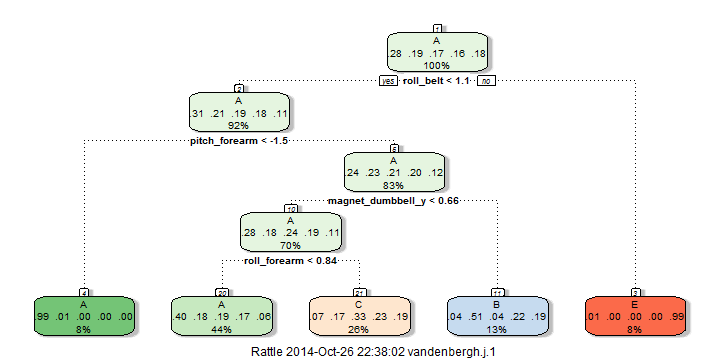

Predicting quality of execution of physical exercises using machine learning techniques
===============================================================================

## Executive Summary

A machine learning algorithm is developed that predicts the manner in which a fitness exercise was performed: correctly or in several incorrect ways. A random forest model is developed using a dataset of 6 subjects performing barbell lifts in 5 different ways. Out-of-sample error rate was brought down to 0.48%.

## Research Question

Using devices such as Jawbone Up, Nike FuelBand, and Fitbit it is now possible to collect a large amount of data about personal activity relatively inexpensively. These type of devices are part of the quantified self movement – a group of enthusiasts who take measurements about themselves regularly to improve their health, to find patterns in their behavior, or because they are tech geeks. One thing that people regularly do is quantify how much of a particular activity they do, but they rarely quantify how well they do it. In this project, we will use data from accelerometers on the belt, forearm, arm, and dumbell of 6 participants. They were asked to perform barbell lifts correctly and incorrectly in 5 different ways. More information is available from the website here: http://groupware.les.inf.puc-rio.br/har (see the section on the Weight Lifting Exercise Dataset).

The goal is to develop a machine learning algorithm that predicts the manner in which a subject did the exercise, using the measurements from the wearable devices.


## Data cleaning and preparation

The data, kindly provided by Veloso et al. (2013), consists of observations about exercises performed by 6 healthy subjects during 8 hours. Exercises are classified in 5 groups: sitting-down, standing-up, standing, walking and sitting (variable "classe"). A baseline performance index has also been established.


```r
library(caret); library(AppliedPredictiveModeling)
exercise <- read.csv("pml-training.csv", header=TRUE, na.strings=c("NA"))
finaltesting <- read.csv("pml-testing.csv", header=TRUE, na.strings=c("NA"))
options(scipen=999) #no scientific notation
```

Since the training data file contains the bulk of the observations, we split it further into a training and testing set, using the last 20 observations only for the final test.


```r
library(caret); library(AppliedPredictiveModeling)
```

```
## Loading required package: lattice
## Loading required package: ggplot2
```

```r
trainIndex = createDataPartition(y=exercise$classe, p = 0.75,list=FALSE)
training = exercise[trainIndex,]
testing = exercise[-trainIndex,]
```

To preprocess the data, we start by removing all columns with too many missing variables and all columns with near zero variance. The rows with calculated aggregate measures (identified by the variable new_window="yes") are removed as well, since they do not appear in the testing set. We also remove the first six variables: these refer to subjects and times of observations, and we are trying to construct a model which can predict classe based solely on movement measurements. Finally, we preprocess the remaining features by centering and scaling.


```r
library(caret); library(AppliedPredictiveModeling)
training <- training[,colSums(is.na(training))<10000]
training <- training[training$new_window=="no",]
nsv <- nearZeroVar(training)
training <- training[,-nsv]
training <- training[,-c(1,2,3,4,5,6)]
preProc <- preProcess(training[,-c(53)],method=c("center","scale"))
trainPC <- predict(preProc,training[-c(53)])
trainPC$classe<-training$classe
```

## Model Building

To predict we start by trying a single tree model, since the outcome variable is a factor. 


```r
library(caret); library(AppliedPredictiveModeling); library(rpart);library(e1071)
treeModelFit <- train(classe~.,data=trainPC,method="rpart")
```


```r
library(rattle)
fancyRpartPlot(treeModelFit$finalModel)
```

 

In order to test the predictions of this model, we use the testing dataset.


```r
library(caret); library(AppliedPredictiveModeling)
testing <- testing[,is.element(colnames(testing),colnames(training))]
testPC <- predict(preProc,newdata=testing[,-53])
testPC$classe<-testing$classe
predictions <- predict(treeModelFit,newdata=testPC)
cm <- confusionMatrix(testPC$classe,predictions)
```

The accuracy of the model is only 0.4969413, so we try improving by using random forests.


```r
library(caret); library(AppliedPredictiveModeling); library(rpart);library(e1071);library(randomForest)
```

```
## randomForest 4.6-10
## Type rfNews() to see new features/changes/bug fixes.
```

```r
set.seed(134)
rfModelFit <- randomForest(trainPC[,-53],trainPC$classe,ntree=500)
rfModelFit
```

```
## 
## Call:
##  randomForest(x = trainPC[, -53], y = trainPC$classe, ntree = 500) 
##                Type of random forest: classification
##                      Number of trees: 500
## No. of variables tried at each split: 7
## 
##         OOB estimate of  error rate: 0.46%
## Confusion matrix:
##      A    B    C    D    E class.error
## A 4104    6    0    0    0 0.001459854
## B    8 2780    4    0    0 0.004297994
## C    0   15 2497    3    0 0.007157058
## D    0    0   24 2336    2 0.011007621
## E    0    0    1    3 2647 0.001508865
```

The estimated out-of-sample error of this model is 0.48%, which would be an acceptable error rate. Again, let's test the predictions of this model.


```r
library(caret); library(AppliedPredictiveModeling)
predictions <- predict(rfModelFit,newdata=testPC)
cm2 <- confusionMatrix(testPC$classe,predictions)
cm2
```

```
## Confusion Matrix and Statistics
## 
##           Reference
## Prediction    A    B    C    D    E
##          A 1394    1    0    0    0
##          B    4  945    0    0    0
##          C    0    6  849    0    0
##          D    0    0    4  800    0
##          E    0    0    0    1  900
## 
## Overall Statistics
##                                           
##                Accuracy : 0.9967          
##                  95% CI : (0.9947, 0.9981)
##     No Information Rate : 0.2851          
##     P-Value [Acc > NIR] : < 2.2e-16       
##                                           
##                   Kappa : 0.9959          
##  Mcnemar's Test P-Value : NA              
## 
## Statistics by Class:
## 
##                      Class: A Class: B Class: C Class: D Class: E
## Sensitivity            0.9971   0.9926   0.9953   0.9988   1.0000
## Specificity            0.9997   0.9990   0.9985   0.9990   0.9998
## Pos Pred Value         0.9993   0.9958   0.9930   0.9950   0.9989
## Neg Pred Value         0.9989   0.9982   0.9990   0.9998   1.0000
## Prevalence             0.2851   0.1941   0.1739   0.1633   0.1835
## Detection Rate         0.2843   0.1927   0.1731   0.1631   0.1835
## Detection Prevalence   0.2845   0.1935   0.1743   0.1639   0.1837
## Balanced Accuracy      0.9984   0.9958   0.9969   0.9989   0.9999
```

The accuracy of the model is 0.9967374, and hence 0.0032626 is a good estimate of the out-of-sample error rate given we withheld this test test from the training set. Note that is also very similar to the estimated out-of-bag error rate (or cross-validation error rate) estimated by the randomForest method.

## Results

Now we apply the machine learning algorithm to the final 20 test cases.


```r
finaltesting <- finaltesting[,is.element(colnames(finaltesting),colnames(training))]
testPC2 <- predict(preProc,newdata=finaltesting)
predictions_final <- predict(rfModelFit,newdata=testPC2)
```


```r
pml_write_files = function(x){
  n = length(x)
  for(i in 1:n){
    filename = paste0("problem_id_",i,".txt")
    write.table(x[i],file=filename,quote=FALSE,row.names=FALSE,col.names=FALSE)
  }
}
pml_write_files(predictions_final)
```


## References

M. A. Hall. Correlation-based Feature Subset Selection
for Machine Learning. PhD thesis, Department of
Computer Science, University of Waikato, Hamilton,
New Zealand, Apr. 1999.

Velloso, E.; Bulling, A.; Gellersen, H.; Ugulino, W.; Fuks, H. Qualitative Activity Recognition of Weight Lifting Exercises. Proceedings of 4th International Conference in Cooperation with SIGCHI (Augmented Human '13) . Stuttgart, Germany: ACM SIGCHI, 2013.

